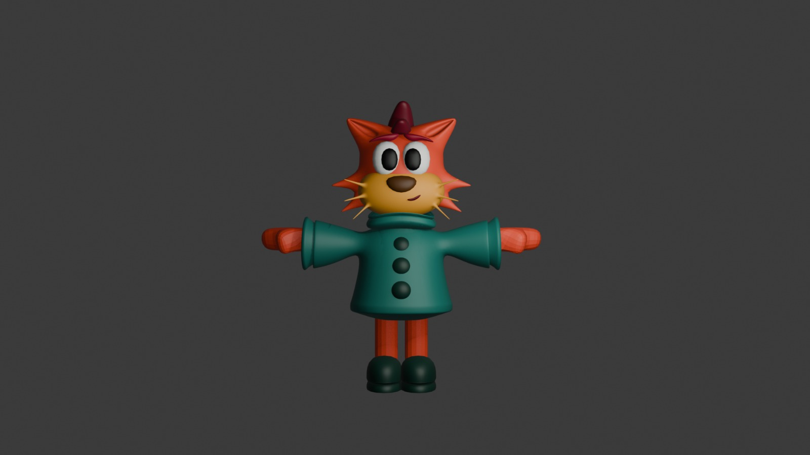
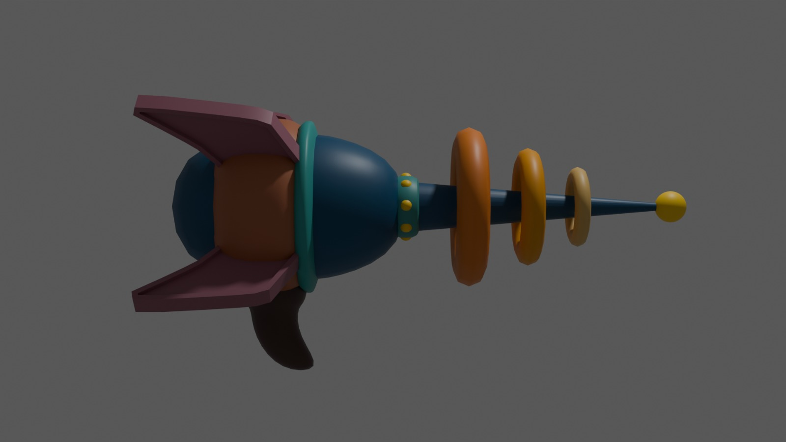
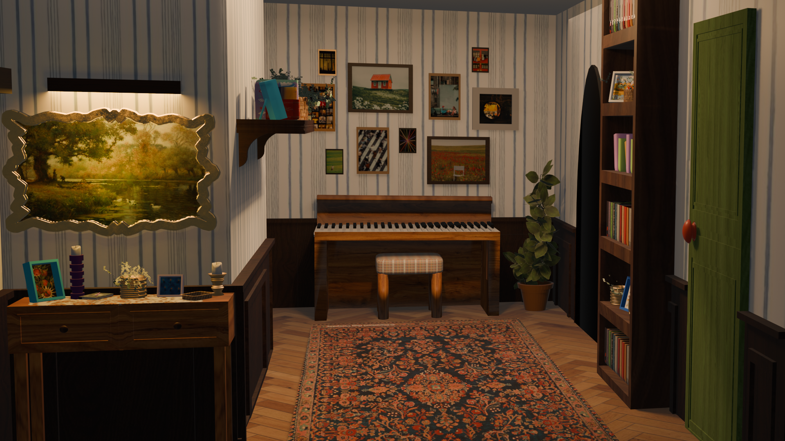
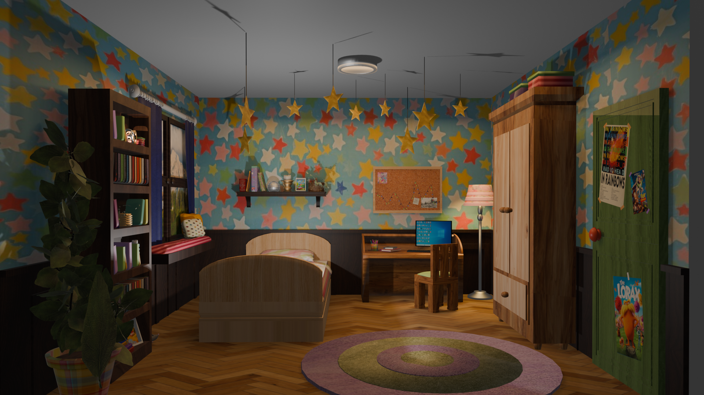
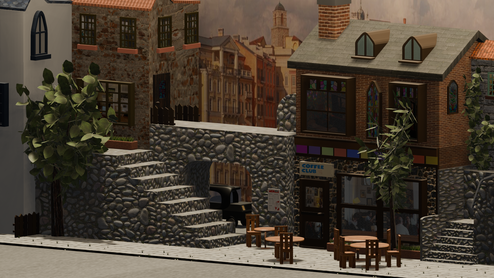

# Blender Portfolio

A collection of my Blender projects created from scratch, including stylized characters, props, and environment designs. These projects showcase my experience in low-poly modeling, environment creation, asset design, and game-ready workflows.

---

## Software

- Blender

## Skills Demonstrated

- Character Modeling
- Environment Design
- Prop Modeling
- Low Poly Modeling
- Stylized Art
- Game Ready Assets

---

# Character Models

## Cartoon Cat

Stylized cartoon character modeled entirely from scratch in Blender.

**Render**

**Wireframe**

---

## Stylized Girl

Stylized low poly character modeled entirely from scratch in Blender.

**Render**

**Wireframe**

---

# Props

## Retro Ray Gun

Stylized sci-fi weapon modeled from scratch in Blender.

**Render**

**Wireframe**

---

# Environment Designs

## Theater Environment

Created for a Game Jam project.

Designed and modeled the theater interior, including the stage, audience seating, curtains, furniture, and overall scene composition.

---

## Stylized House

Simple stylized low poly house modeled from scratch.

---

# Previous Projects

These are some of my earlier Blender projects that helped me improve my modeling, lighting, and environment design skills.

## Fish Tank

---

## Hall

---

## Room

---

## Street

